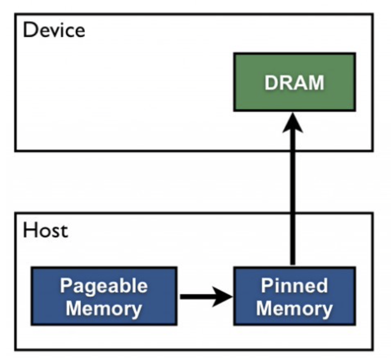

## TP4 : Programmation GPU en CUDA

Dans L'exercice 1 : 
1.4 Allouez la mémoire hôte pour le vecteur à l'aide de **cudaHostAlloc** au lieu de malloc

### Objectifs du TP :
---------------------
* Comparez les temps de copie mémoire paginée vs. mémoire épinglée.
* Comprendre comment executer des streams de façon concurrentes.
* Comparer l'execution du programme utilisant des nombres flottant en precision simple vs. en precision double.

### Informations sur le TP :
----------------------------
* Le TP est à réaliser seul ou en binôme.
* A rendre sur ametice en spécifiant si vous avez fait le TP seul ou en binôme, en mentionnant votre prénom ainsi que votre nom (prénom et nom de chaque membre si en binôme).
* A rendre avant le 24 mars 2023, 24:00.

### Exercice 1 : Mémoire paginée vs. épinglée.
----------------------------------------------

#### Mémoire paginée

La mémoire alloué par malloc est paginable.

la fonction **cudaMemcpy** convertie implicitement la mémoire paginable en mémoire épinglé temporaire. C'est à dire que cette mémoire restera present sur la mémoire vive de l'ordinateur pendant toute l'execution du programme. 

Deux transferts de mémoire sont effetués. Par conséquent, ce type d'allocation et de transfert de mémoire est lent.

#### Mémoire épinglée

Nous avons vue en CM qu'il est possible de directement allouer de la mémoire épinglé via **cudaHostAlloc()**. En passant par cette fonction nous n'avons qu'un seul transfert de mémoire.

L'inconvénient est que, comme les données sont initialisées dans la mémoire épinglée, la disponibilité de la mémoire pour le CPU est réduite.

### Exercice 2 : Streams et execution asynchrone
------------------------------------------------

L'objectif de ce TP est d'executer une version concurrente du code en utilisant les **streams** de CUDA.

le code fournit effectue un calcul par élément sur un vecteur 1D. Chaque thread opère sur un élément du vecteur.

Le kernel calcul la moyenne de la densite de probabilité sur un interval de valeurs autour de chaque élément.

la fonction de densité de probabilité est donnée par l'équation suivante :

ou z est la loi normale donnée par l'équation :

une loi normale de moyenne (**mean**) nulle, et d'ecart type (**sigma**) unitaire est appelée **loi normale centrée réduite** ou **loi normale standard**. Dans le code, mean est fixée à 0 et sigma à 1, donc z est une loi normale standard.

Pour ce TP, il n'est pas utile de connaitre ces notions qui sont déjà implementées. Je laisse neanmoins le lien suivant pour ceux à qui ça intéresse. [Loi normale](https://fr.wikipedia.org/wiki/Loi_normale)
